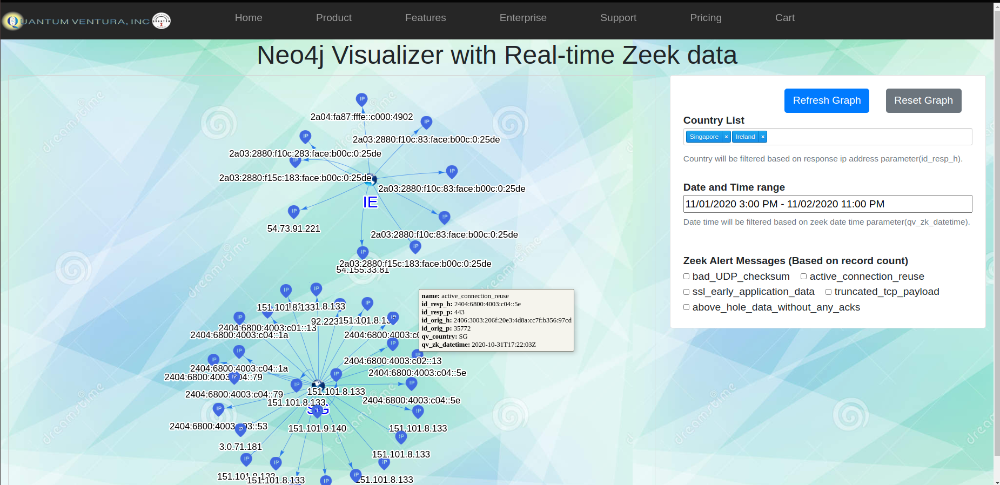
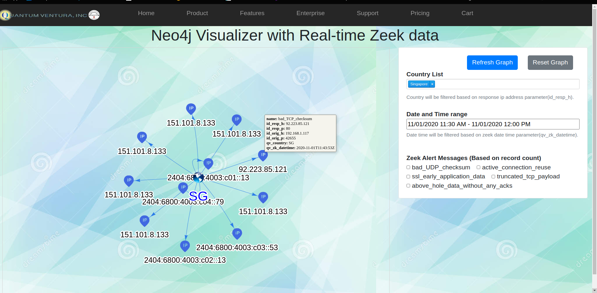
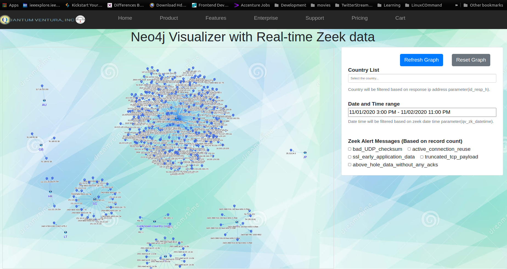

# Neo4jVizualizer
NeoVizualizer will show all the zeek data feeded in Neo4j Graph Database to show all ip address and its dependent countries in NeoViz.Each node data can be filtered based on location, timestamp and protocol occurrence name. Each node tooltip will provide more details about source and destination ip address.

### Country wise Ip Address

### Based on Selected timestamp

### All Country Ip Address
